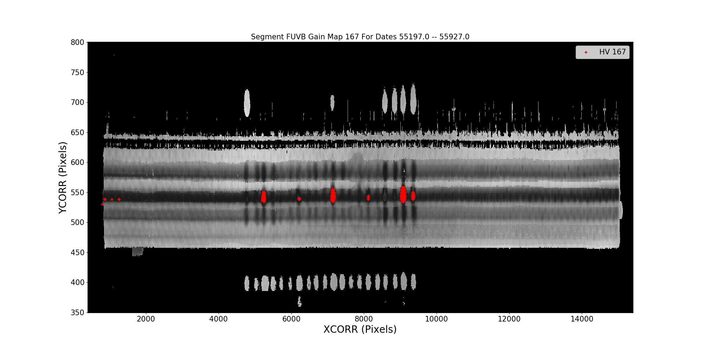
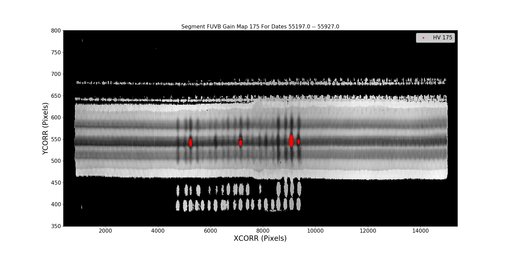
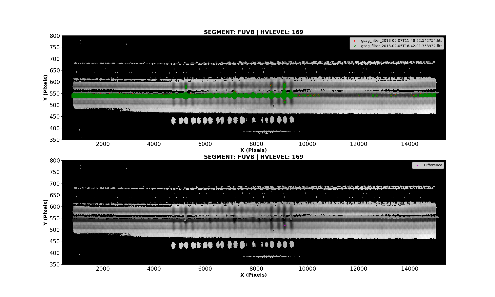
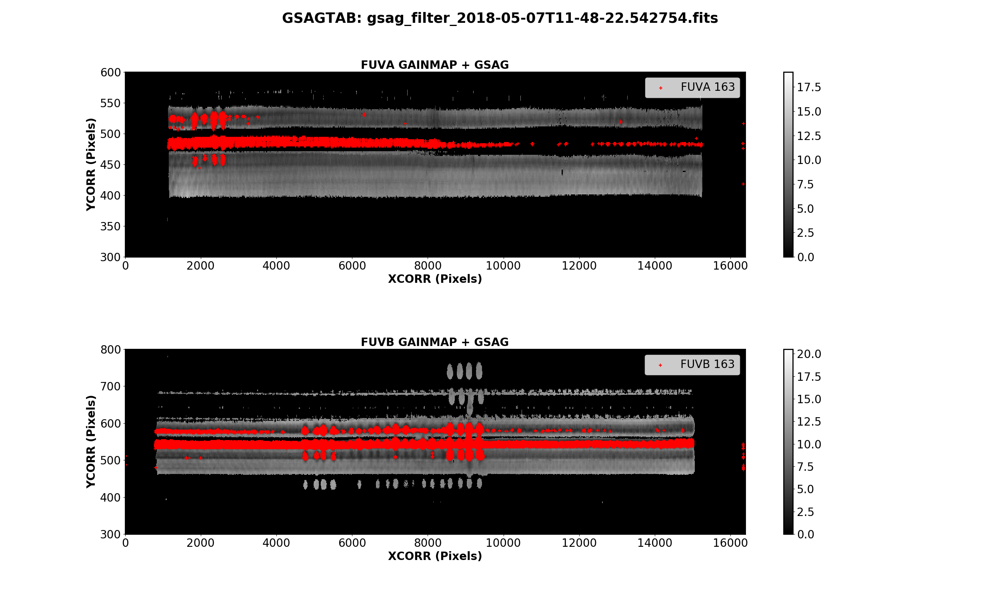

# peewee4cosmo

peewee4cosmo is a backend database that supports the monitoring efforts of the Cosmic Origins Spectrograph (COS) team
at the Space Telescope Science Institute (STScI) in Baltimore, MD. This project was based off of the COS Monitoring
(COSMO) project that was created by Justin Ely. Like COSMO, peewee4cosmo uses a MySQL database server with a
object-relational mapper (ORM) Peewee instead of SQL Alchemy. The aim of this project is to provide the COS team and
community with updated monitoring data, track detector trends, and have the most up-to-date resources available to
extend the lifetime of COS.

# Dependencies

This tool requires a few packages all of which are included in the Anaconda python distribution.

* [PEEWEE](http://docs.peewee-orm.com/en/latest/)

* AstroPy

* NumPy

* Matplotlib

# Installation

Download the .zip file or clone the respository from GitHub and install the tool from inside the
resulting directory with `python setup.py install`

# Usage

> TO USE THIS REPOSITORY FOR IT'S INTENDED USE YOU MUST BE A PART OF THE COS TEAM!
> BEFORE RUNNING YOU WILL NEED TO MAKE A CONFIGURATION FILE THAT WILL CONTAIN THE CREDENTIALS
> TO LOG INTO THE DATABASE.

peewee4cosmo is used via entry points when the package is installed. Here are the most used cases:

`$ cm_ingest # This runs the ingestion process that pre-processes and store data in the tables.`

`$ cm_monitors # This runs the monitors that print information to screen and creates figures.`

Convenience functions for gain sag table and gain maps:

    $ cosmo_gsagtab_by_date --help
        usage: cosmo_gsagtab_by_date [-h] [--segment SEGMENT] [--min_date MIN_DATE]
                             [--max_date MAX_DATE] [--compare COMPARE]

        optional arguments:
          -h, --help           show this help message and exit
          --segment SEGMENT    FUVA or FUVB
          --min_date MIN_DATE  Minimum date when gainsag holes appeared
          --max_date MAX_DATE  Minimum date when gainsag holes appeared
          --compare COMPARE    Compare to CRDS gsagtab

    $ cosmo_gsagtab_residual_plot --help
        usage: cosmo_gsagtab_residual_plot [-h] [--old_gsagtab OLD_GSAGTAB]
                                   [--new_gsagtab NEW_GSAGTAB]
                                   [--out_dir OUT_DIR]

        optional arguments:
          -h, --help            show this help message and exit
          --old_gsagtab OLD_GSAGTAB
                                Path to gsagtab
          --new_gsagtab NEW_GSAGTAB
                                Path to gsagtab
          --out_dir OUT_DIR     Path you want to write plot out to.

    $ cosmo_gsagtab_creator --help
        usage: cosmo_gsagtab_creator [-h] [--out_directory OUT_DIRECTORY]
                             [--filter FILTER] [--blue BLUE]
                             [--by_date BY_DATE] [--tab_date TAB_DATE]

        optional arguments:
          -h, --help            show this help message and exit
          --out_directory OUT_DIRECTORY
                                Path you want to write gsagtab out to.
          --filter FILTER       Do you want to filter the gainsag tab?
          --blue BLUE           Do you want to make a blue mode table?
          --by_date BY_DATE     Do you want plan to make a table up to a certain date?
          --tab_date TAB_DATE   Date to make table up to.

    $ cosmo_gainmap_gsag_plot --help
        usage: cosmo_gainmap_gsag_plot [-h] [--gsagtab GSAGTAB] [--hv_lvl HV_LVL]

        optional arguments:
          -h, --help         show this help message and exit
          --gsagtab GSAGTAB  Path to gsagtab
          --hv_lvl HV_LVL    High Voltage Level

# Examples

### cosmo_gsagtab_by_date
This entry point allows users to create that show the gain sag progression over selected dates.

**The gain map is the most up-to-date gain map. Other regions maybe sagged but the purpose of this plot is to show gain
sag progress of regions over the dates selected!**

By default we set the segment argument to be FUVB because of how quickly it degrades.

    $ cosmo_gsagtab_by_date --min_date 55197 --max_date 55927
    monitor_directory_from_configure.yaml/CCI/gsagtab_comparisons/gsag_by_date_55197-55927_167_FUVB.png
    monitor_directory_from_configure.yaml/CCI/gsagtab_comparisons/gsag_by_date_55197-55927_175_FUVB.png

For FUVB, the high voltage was raised over the time period we selected from 167 to 175.

But you can select FUVA using the segment argument.

    $ cosmo_gsagtab_by_date --min_date 55197 --max_date 55927 --segment FUVA
    monitor_directory_from_configure.yaml/CCI/gsagtab_comparisons/gsag_by_date_55197-55927_169_FUVA.png

FUVA was only operating at one high voltage over the same time period. Only one plot was created.

### cosmo_gsagtab_residual_plot
This entry point allows users to create figures that show the difference in gainsag between two different gain maps.

**The gain map is the most up-to-date gain map. Other regions maybe sagged but the purpose of this plot is to
show the difference between two gain sag tables!**

`$ cosmo_gsagtab_residual_plot --old_gsagtab monitor_directory_from_configure.yaml/CCI/gsag_filter_2018-02-05T16-42-01.
353932.fits --new_gsagtab monitor_directory_from_configure.yaml/CCI/gsag_filter_2018-05-07T11-48-22.542754.fits
--out_dir some/dir/you/like`

If there are any difference in other high voltage levels in the tables, a plot with the naming convention
`gsagtab_residual_comparion_segment_hv_lvl.png` will be written to the out_dir provided. Here we selected one
of the high voltage levels (169) for this example.

### cosmo_gsagtab_creator
This entry point allows users to create gain sag tables up to a certain date. This functionality is great for making
gain sag tables on the fly.

### cosmo_gainmap_gsag_plot
This entry point creates a figure of the gain sag plotted on top of the gain map for a specific high voltage level.

**The gain map is the most up-to-date gain map. Other regions maybe sagged but the purpose of this plot is show the sagged pixels in physical detector space!**

`$ cosmo_gainmap_gsag_plot --gsagtab monitor_directory_from_configure.yaml/CCI/gsag_filter_2018-05-07T11-48-22.542754.fits --hv_lvl 163`

`$ open monitor_directory_from_configure.yaml/CCI/gainmap_gsagtab_delivery_plots/gainmap_gsag_filter_2018-05-07T11-48-22.542754_163.png`

# Build status

Unit Tests: 
